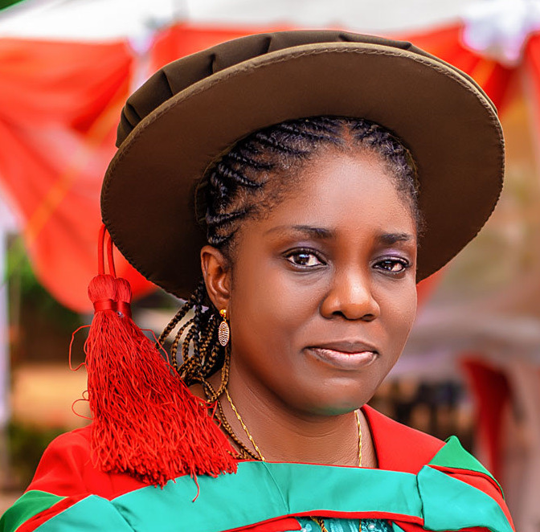

<!--
**OgeNI/OgeNI** is a ✨ _special_ ✨ repository because its `README.md` (this file) appears on your GitHub profile.

Here are some ideas to get you started:

- 🔭 I’m currently working on ...
- 🌱 I’m currently learning ...
- 👯 I’m looking to collaborate on ...
- 🤔 I’m looking for help with ...
- 💬 Ask me about ...
- 📫 How to reach me: ...
- 😄 Pronouns: ...
- ⚡ Fun fact: ...
-->

 <h1>OGECHUKWU NKECHINYELU ILOANUSI, Ph.D. </h1>

### Expertise

#### 
- University Teaching  
- Graduate Supervision  
- Research in Biometrics Recognition, Computer Vision, Artificial Intelligence and Deep Learning  
- Gen AI Engineering  

### About Ogechukwu Iloanusi

##### Oge is a Full Professor at the Department of Electronic and Computer Engineering, Faculty of Engineering, University of Nigeria, Nsukka Campus. Oge holds a B.Eng. in Electronic Engineering; M.Eng. in Digital Electronics and Computer; and Ph.D. in Digital Electronics and Computer (Biometrics recognition). Her research interests include Biometrics Recognition and Image Processing, Generative AI Engineering, Artificial Intelligence, AI-Internet of Things, Computer Vision and Machine / Deep Learning.

##### Oge has taught a total of seventeen (17) courses since 2006, of which eleven (11) are undergraduate courses at the University of Nigeria. The courses include digital signal processing, advanced signal processing, image processing, biometrics recognition and machine learning, control systems, control engineering, engineering computer programming, digital logic theory, physical electronics, microelectronics, solid state electronics, advanced security systems, technical writing, integrated electronics, analog electronics and digital systems design. The undergraduate class sizes are typically about 120. 

##### Since 2013, she has completed supervision of 30 Ph.D. and Masters students. She has completed supervision of 41 group projects of least 110 undergraduate students since 2006. She is also the Director of research in the Biometrics Vision and Computing laboratory (BVCLab). She has over 60 journal and conference publications and has attended over 20 conferences and workshops internationally in countries in Africa, North America, Europe and the Middle East. 

##### She served as the first female Chair of Department of Electronic and Computer Engineering, University of Nigeria from August 1, 2020 through July 31, 2023. She was promoted to the rank of Professor in October 1, 2019, and is the first female Professor in the Faculty of Engineering, University of Nigeria since its inception. 

##### She has served as an Assistant Guest Professor in a one-year contract with the Computer Science and Engineering Department, College of Engineering, University of Notre Dame, Notre Dame, IN, USA, from a period of August 2016 to August 2017. She also participated in a Teaching Fellowship for African University Professors at the Electrical Engineering Computer Science (EECS), Massachusetts Institute of Technology, from September to December 2013. She was also granted a Commonwealth Academic Fellowship Award by the Commonwealth Scholarship Commission in the UK as a Visiting Fellow at the Electronic Engineering Department, University of Southampton from September 2012 to December 2012. She was twice a Visiting Scholar at the Lane Department of Computer Science and Electrical Engineering, College of Engineering and Mineral Resources, West Virginia University where she carried out pre-doctoral research for a total of ten months from August 2009 to November 2009 and April 2010 to November 2010.

### Publications

<h4><a href="https://scholar.google.com/citations?user=9q7IHY8AAAAJ&hl=en" [target="_blank"]>Publications</a></h4>

### Research

##### <a href="https://biometricsvision.com/" target="_blank">Research</a>

### Repositories
#### Github

###### Please note that these datasets are not available for cloning. Make a formal request via email provided in each repo page.

##### Fingerprint image processing and binarization algorithm [ <a href="https://github.com/OgeNI/FingerprintProcessBinarize" >Available here</a> ]

##### Fingerprint Dataset [ <a href="https://github.com/OgeNI/BVC_Fingerprint_data_2016" >Available here</a> ]

##### Faces Dataset [ <a href="https://github.com/OgeNI/BVC_Face_Images" >BVC Face Images</a> ]

##### Body Dataset [ <a href="https://github.com/OgeNI/BVC_Body_Images" >Available here</a> ]

##### Challenging Voice Dataset [ <a href="https://github.com/OgeNI/BVC_Challenging_Voice_Set" >Available here</a> ]

##### Afro Voice dataset [ <a href="https://github.com/OgeNI/BVC_Afro_Voice_data" >Available here</a> ]

### IT Skills

#####
- Generative AI programming: Developing Tools and Agentic workflows, Gen AI model fine-tuning
- Computer vision & Deep learning: CV Model training from scratch, transfer learning/fine-tuning, model analysis
- Biometrics recognition: Large programming code base for Fingerprint, Face, Voice, Iris recognition
- Operating Systems: Linux CLI, Macintosh CLI & GUI, Windows CLI & Windows GUI  
- Programming languages: Python, Linux shell programming, MATLAB programming, JavaScript, Perl, Visual Basic. Over a total of 3200 personally coded programming files in code base  
- Scripting Languages / Web definition languages:  HTML definition language, PHP, Java Applets  
- Applications: All Microsoft Office applications, Adobe creative cloud  
- Integrated development platforms / frameworks: Django, Docker, Nuxt, VueJs, Ionic Vue, Visual Studio code.  
 

